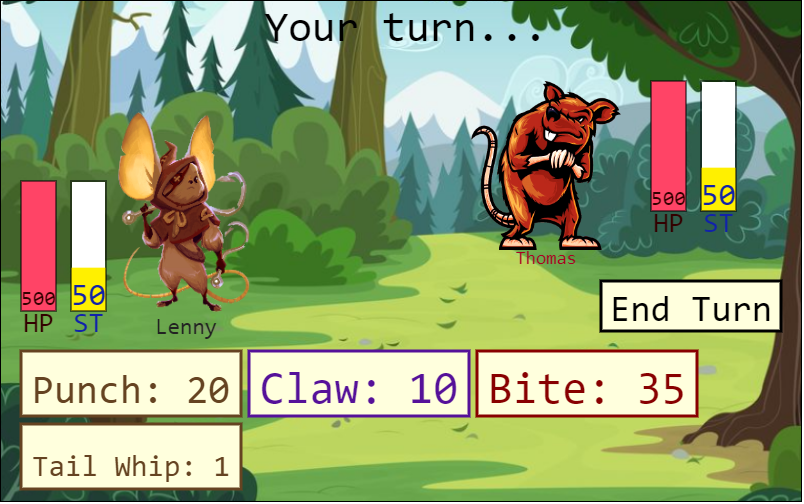

# RodentRumbleJS

A turn-based fighting game I have been iterating on for years, this time with graphics!
# Gameplay Loop
Pick a rodent type to play as, each has different abilities and stats.
Engage in combat vs AI controlled opponents.
## Combat
Pick a move, balancing damage and attributes with the stamina cost of the attack.
Opponent attacks back.
Rewarded with XP

## Progression
XP can be used to upgrade stats or learn new moves

Combat system and stat upgrading systems in place.
Rodent types are in place.

WIP:
move learning, art, compilation of everything together.
